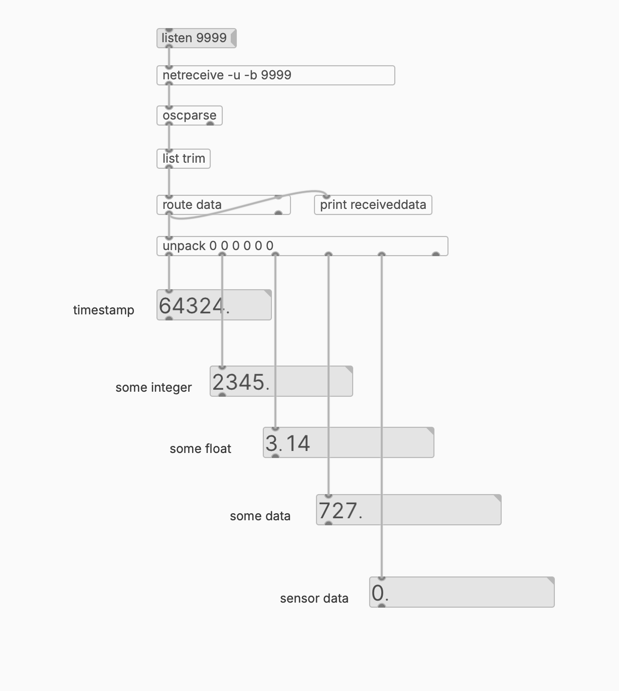

esp32-osc
---------

this demo sends numbers via osc to all hosts in the wifi network (udp port 9999) on an esp32 microcontroller

#needed library for arduino IDE
- AsyncUDP
- Chrono
- OSC

# sending data with the esp32/arduino

change *sendDataOSC()* in osc.ino tab
```
  oscMsg.add((int)millis());        // send timestamp form arduino 
  oscMsg.add((int)2345);            // sends data (integer)
  oscMsg.add((float)3.14);          // sends data (float)
  oscMsg.add(data);                 // send data (from variable)
  oscMsg.add((int)analogRead(15));  // sends readout fron analog pin (integer)
  ```

# receiving osc data with pure data


